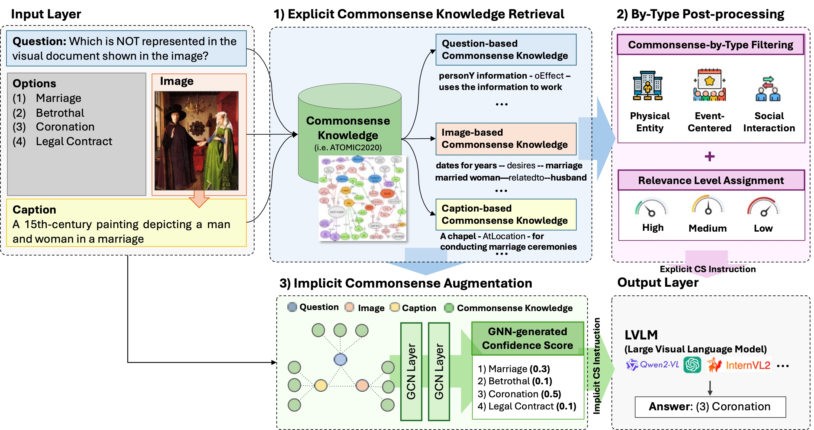

# MAGIC-VQA: Multimodal And Grounded Inference with Commonsense Knowledge for Visual Question Answering

<div align="center">
      <h2>Authors</h2>
      <p>
        <strong>Shuo Yang</strong><sup>1</sup>,  
        <strong>Soyeon Caren Han</strong><sup>1,*</sup>,  
        <strong>Siwen Luo</strong><sup>2</sup>,  
        <strong>Eduard Hovy</strong><sup>1</sup>
        <br>
      </p>
</div>

<div align="center">
    <p>
        <sup>1</sup> The University of Melbourne
        <sup>2</sup> The University of Western Australia
    </p>
</div>

<div align="center">
<p>
      <a href="mailto:shuo.yang.3@unimelb.edu.au">shuo.yang.3@unimelb.edu.au</a> 
      <a href="mailto:caren.han@unimelb.edu.au">caren.han@unimelb.edu.au</a>,  
</p>
</div>

<div align="center">

<strong style="font-size: 18px;">Accepted by the 2025 Association for Computational Linguistics: ACL 2025</strong> <br>
    <strong style="font-size: 18px;">(ACL 2025)</strong>
</div>


Implementation of [MAGIC-VQA](https://aclanthology.org/2025.findings-acl.872/). 


<p align="center"></p>


## Updates
- [08/24/2025]:🎉 We have released the code for MAGIC-VQA. 

## Abstract
Visual Question Answering (VQA) requires reasoning across visual and textual modalities, yet Large Vision-Language Models (LVLMs) often lack integrated commonsense knowledge, limiting their robustness in real-world scenarios. To address this, we introduce MAGIC-VQA, a novel framework that enhances VQA by systematically integrating  commonsense knowledge with LVLMs.
MAGIC-VQA employs a three-stage process: (1) Explicit Knowledge Integration from external sources, (2) By-Type Post-Processing for contextual refinement, and (3) Implicit Knowledge Augmentation using a Graph Neural Network (GNN) for structured reasoning. While GNNs bring greater depth to structured inference, they enable superior relational inference beyond LVLMs. MAGIC-VQA bridges a key gap by unifying commonsensse knowledge with LVLM-driven reasoning, eliminating the need for extensive pre-training or complex prompt tuning.
Our framework achieves state-of-the-art performance on benchmark datasets, significantly improving commonsense reasoning in VQA.

## How to Use MAGIC-VQA 
Following the original paper, please first use the CLIP_Retrieval to retreive and proceed with the filtered triplets. Then use the GCN training for train the graph network and do the inference. 

The result for ScienceQA, TextVQA, MMMU and their responding knowledge triplets can be found in the Atomic folder.


------


If you find our method useful, please kindly cite our paper.
```bibtex
@inproceedings{yang-etal-2025-magic,
    title = "{MAGIC}-{VQA}: Multimodal And Grounded Inference with Commonsense Knowledge for Visual Question Answering",
    author = "Yang, Shuo  and
      Han, Caren  and
      Luo, Siwen  and
      Hovy, Eduard",
    editor = "Che, Wanxiang  and
      Nabende, Joyce  and
      Shutova, Ekaterina  and
      Pilehvar, Mohammad Taher",
    booktitle = "Findings of the Association for Computational Linguistics: ACL 2025",
    month = jul,
    year = "2025",
    address = "Vienna, Austria",
    publisher = "Association for Computational Linguistics",
    url = "https://aclanthology.org/2025.findings-acl.872/",
    doi = "10.18653/v1/2025.findings-acl.872",
    pages = "16967--16986",
    ISBN = "979-8-89176-256-5"
}
```

## 4. Contributing
We welcome contributions from the research community to improve the efficiency of MAGIC-VQA. If you have any idea or would like to report a bug, please open an issue or submit a pull request.

## 5. License
The code is released under the MIT License.

